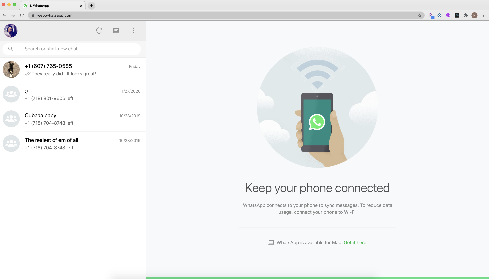
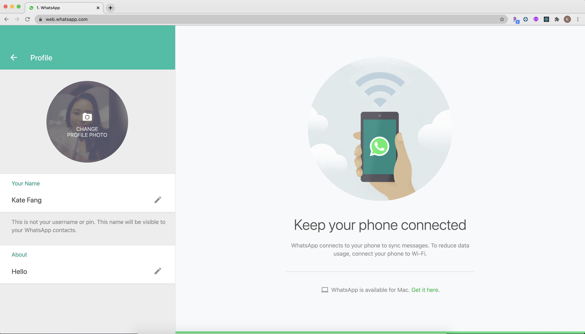
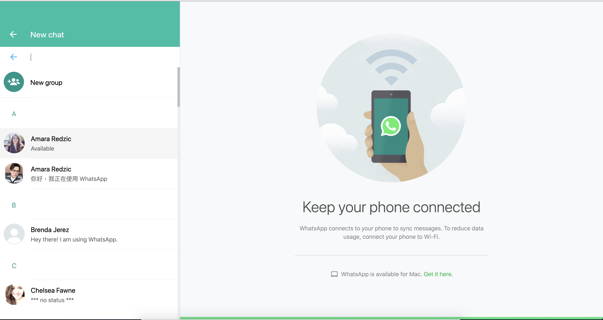
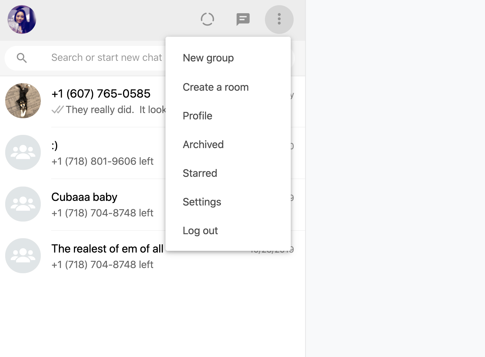
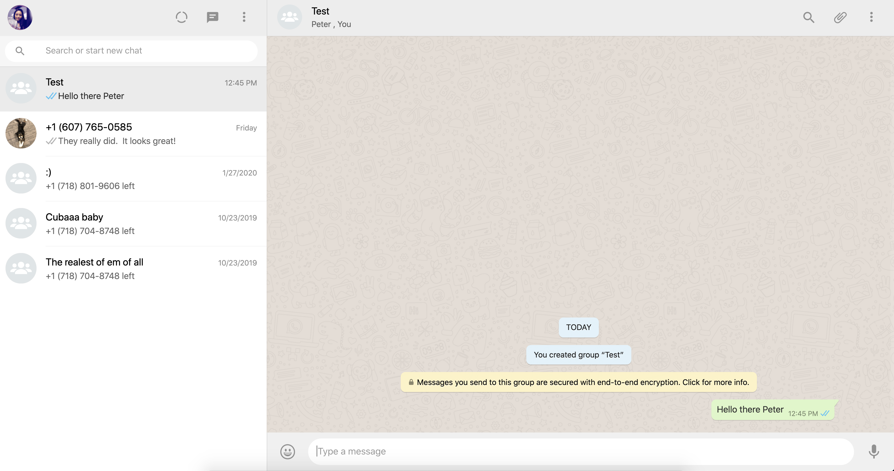
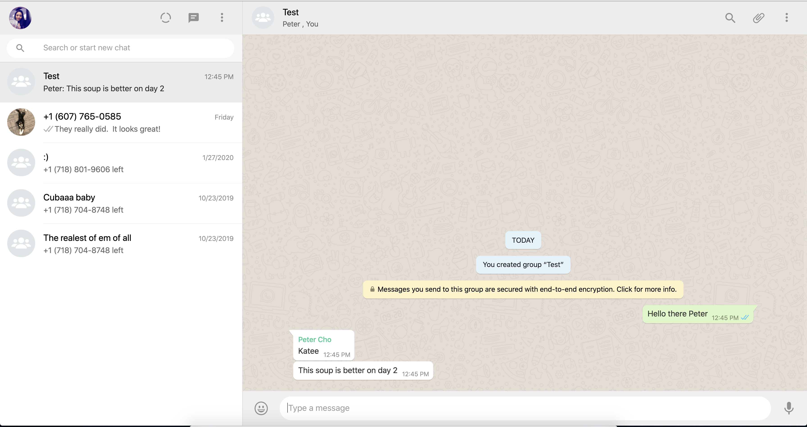

# wazzapp

<br/> 

- [Overview](#overview)
- [MVP](#mvp)
  - [Goals](#goals)
  - [Libraries and Dependencies](#libraries-and-dependencies)
  - [Client (Front End)](#client-front-end)
    - [Wireframes](#wireframes)
    - [Component Tree](#component-tree)
    - [Component Hierarchy](#component-hierarchy)
    - [Component Breakdown](#component-breakdown)
    - [Time Estimates](#time-estimates)
  - [Server (Back End)](#server-back-end)
    - [ERD Model](#erd-model)
- [Post-MVP](#post-mvp)
- [Code Showcase](#code-showcase)
- [Code Issues & Resolutions](#code-issues--resolutions)

<br>

## Overview

_**Wazzapp**, as you can infer from the name, is an atempted replicate of Whatsapp.

<br>

## MVP

- Users will be able to create chat groups with/without group names 
- Users will be able to delete chat groups or leave chatgroups.  

<br>

### Goals

- _Wazzap will very closely resemble Whatsapp_

<br>

### Libraries and Dependencies

> Use this section to list all supporting libraries and dependencies, and their role in the project. Below is an example - this needs to be replaced!

|     Library      | Description                                |
| :--------------: | :----------------------------------------- |
|      React       | _Will use React for the front end_ |
|   React Router   | _Route Users to different pages_ |
| React Bootstrap  | _Will use Bootstrap to speed up front end building_|
|     Express      | _Will use rails for the backend_ |

<br>

### Client (Front End)

#### Wireframes

##### Desktop view #1


##### Desktop view #2


##### Desktop view #3


##### Desktop view #4


##### Desktop view #5


##### Desktop view #6


|##### mobile view #1 | ##### mobile view #2|
|||

##### mobile view #3


##### mobile view #4


##### Component Tree

> Use this section to display the structure of how your React components are being rendered. This should show the parent to child relation between you components. In other words, show which components are rendering the other components. 

#### Component Hierarchy

> Use this section to define your React components and the data architecture of your app. This should be a reflection of how you expect your directory/file tree to look like. 

``` structure

src
|__ assets/
      |__ fonts
      |__ graphics
      |__ images
      |__ mockups
|__ components/
      |__ Header.jsx
|__ services/

```

#### Component Breakdown

> Use this section to go into further depth regarding your components, including breaking down the components as stateless or stateful, and considering the passing of data between those components.

|  Component   |    Type    | state | props | Description                                                      |
| :----------: | :--------: | :---: | :---: | :--------------------------------------------------------------- |
|    Header    | functional |   n   |   n   | _The header will contain the navigation and logo._               |
|  Navigation  | functional |   n   |   n   | _The navigation will provide a link to each of the pages._       |
|   Gallery    |   class    |   y   |   n   | _The gallery will render the posts using cards in flexbox._      |
| Gallery Card | functional |   n   |   y   | _The cards will render the post info via props._                 |
|    Footer    | functional |   n   |   n   | _The footer will show info about me and a link to my portfolio._ |

#### Time Estimates

> Use this section to estimate the time necessary to build out each of the components you've described above.

| Task                | Priority | Estimated Time | Time Invested | Actual Time |
| ------------------- | :------: | :------------: | :-----------: | :---------: |
| Add Contact Form    |    L     |     3 hrs      |     2 hrs     |    3 hrs    |
| Create CRUD Actions |    H     |     3 hrs      |     1 hrs     |     TBD     |
| TOTAL               |          |     6 hrs      |     3 hrs     |     TBD     |

> _Why is this necessary? Time frames are key to the development cycle. You have limited time to code your app, and your estimates can then be used to evaluate possibilities of your MVP and post-MVP based on time needed. It's best you assume an additional hour for each component, as well as a few hours added to the total time, to play it safe._

<br>

### Server (Back End)

#### ERD Model

> Use this section to display an image of a computer generated ERD model. You can use draw.io, Lucidchart or another ERD tool.

<br>

***

## Post-MVP

> Use this section to document ideas you've had that would be fun (or necessary) for your Post-MVP. This will be helpful when you return to your project after graduation!

***

## Code Showcase

> Use this section to include a brief code snippet of functionality that you are proud of and a brief description.

## Code Issues & Resolutions

> Use this section to list of all major issues encountered and their resolution.
