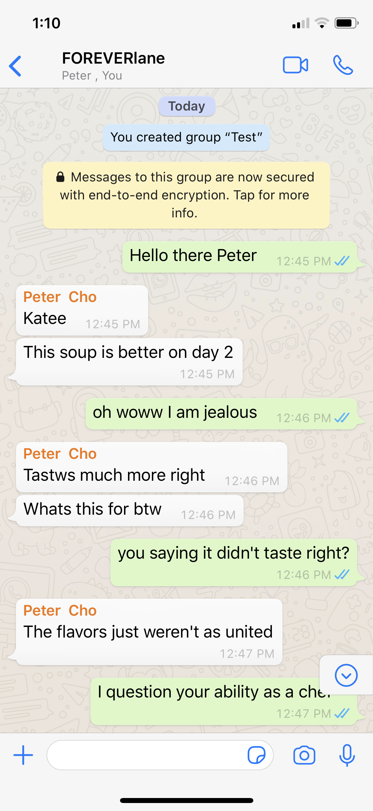

# Wazzapp

<br/>

- [Overview](#overview)
- [MVP](#mvp)
  - [Goals](#goals)
  - [Libraries and Dependencies](#libraries-and-dependencies)
  - [Client (Front End)](#client-front-end)
    - [Wireframes](#wireframes)
    - [Component Tree](#component-tree)
    - [Component Hierarchy](#component-hierarchy)
    - [Component Breakdown](#component-breakdown)
    - [Time Estimates](#time-estimates)
  - [Server (Back End)](#server-back-end)
    - [ERD Model](#erd-model)
- [Post-MVP](#post-mvp)
- [Code Showcase](#code-showcase)
- [Code Issues & Resolutions](#code-issues--resolutions)

<br>

## Overview

**Wazzapp**, as you can infer from the name, is an attempted replica of Whatsapp.

<br>

## MVP

- User CRUD
- Chat groups CRUD

<br>

### Goals

- _Wazzap will very closely resemble Whatsapp_

<br>

### Libraries and Dependencies

> Use this section to list all supporting libraries and dependencies, and their role in the project. Below is an example - this needs to be replaced!

|     Library     | Description                                         |
| :-------------: | :-------------------------------------------------- |
|      React      | _Will use React for the front end_                  |
|  React Router   | _Route Users to different pages_                    |
| React Bootstrap | _Will use Bootstrap to speed up front end building_ |
|      Rails      | _Will use rails for the backend_                    |
|      Rails      | _Will use rails for the backend_                    |
|     Bcrypt      | _User Encryption_                                   |
|       JWT       | _User Auth_                                         |

<br>

### Client (Front End)

#### Wireframes

#### Desktop view #1


#### Desktop view #2


#### Desktop view #3


#### Desktop view #4


#### Desktop view #5


#### mobile view #1


#### mobile view #2


#### mobile view #3


#### mobile view #4



#### mobile view #5


#### Component Tree

#### Component Hierarchy

> Use this section to define your React components and the data architecture of your app. This should be a reflection of how you expect your directory/file tree to look like.

```structure

src
|__ images
|__ components/
      |__ chat-list.component.jsx
      |__ settings.component.jsx
      |__ edit-profile.component.jsx
      |__ add-partcipants.component.jsx
      |__ chat-screen.component
|__ services/
    |__ apiHelper.js
    |__ user.js
    |__ auth.js

```

#### Component Breakdown

> Use this section to go into further depth regarding your components, including breaking down the components as stateless or stateful, and considering the passing of data between those components.

|    Component     |    Type    | state | props | Description                                    |
| :--------------: | :--------: | :---: | :---: | :--------------------------------------------- |
|    chat-list     | functional |   y   |   y   | _list of chats_                                |
|     settings     | functional |   y   |   y   | _User can update user settings_                |
|   edit-profile   | functional |   y   |   y   | _User can edit user profile_                   |
| add-participants | functional |   y   |   y   | _User can add friends_                         |
|   chat-screen    | functional |   y   |   y   | _User can chat here and see past chat history_ |

#### Time Estimates

| Task      | Priority | Estimated Time | Time Invested | Actual Time |
| --------- | :------: | :------------: | :-----------: | :---------: |
| CSS       |    H     |     20 hrs     |      TBH      |     TBH     |
| Front End |    VH    |     30 hrs     |      TBH      |     TBH     |
| Back End  |    H     |     15 hrs     |      TBH      |     TBD     |
| TOTAL     |          |     6 hrs      |      TBH      |     TBD     |

<br>

### Server (Back End)

#### ERD Model


<br>

---

## Post-MVP

- User will be able to reply to individual messages

---

## Code Showcase

> Use this section to include a brief code snippet of functionality that you are proud of and a brief description.

## Code Issues & Resolutions

> Use this section to list of all major issues encountered and their resolution.
